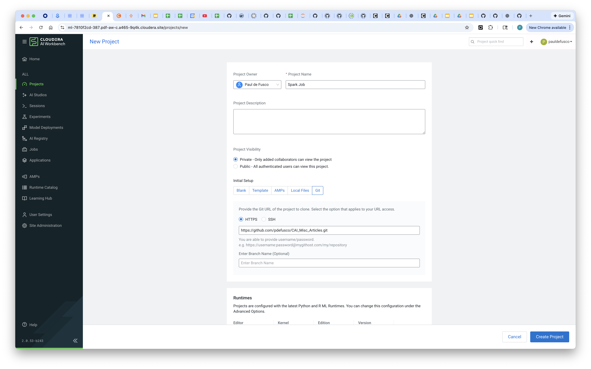
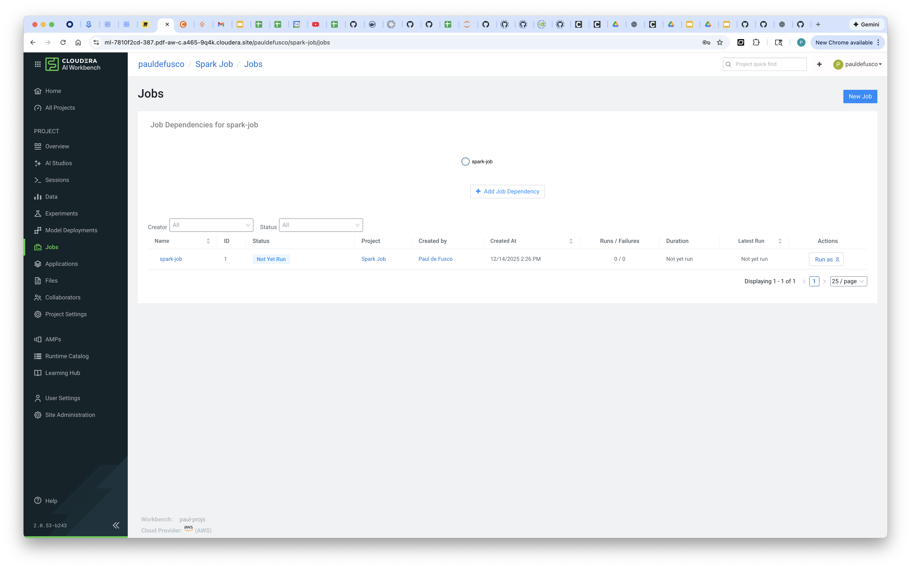
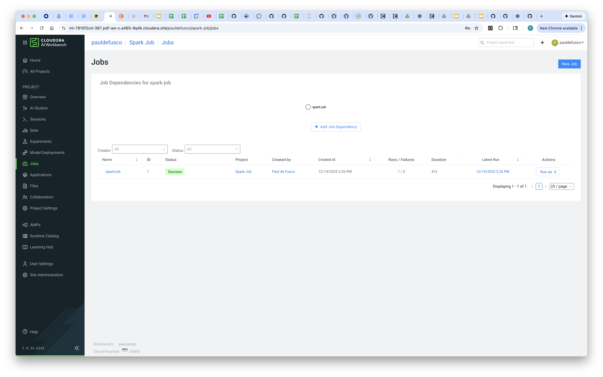
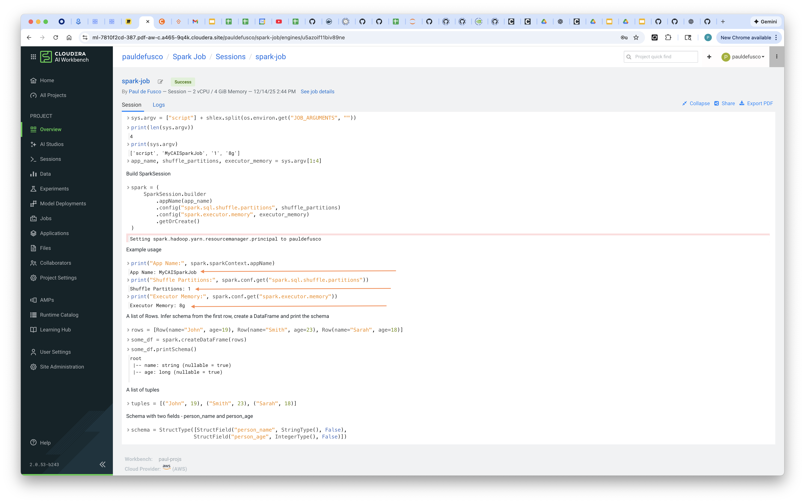

# How to Create and Run a Spark Submit in a CAI Job

## Objective

This article provides an introduction to creating and parameterizing a Spark Submit as a CAI Job.

## Motivation

Spark Submits can be executed in CAI leveraging the Spark on Kubernetes runtime. If you want to translate Spark Submits into CAI Jobs you have to create a CAI Job definition specifying Spark Submit options as CAI Job Arguments and update your Spark application code to parse those Spark options as sys args.

## Requirements

A CAI Workbench in Cloudera on Cloud or on Prem.

## Mapping a Spark Submit to CAI Job

Assume starting with a Spark Submit like this:

```
spark-submit my_app.py \
  --app-name MySparkJob \
  --shuffle-partitions 50 \
  --executor-memory 4g
```

If you want to run this as a CAI Job you have to refactor you PySpark code to parse three arguments: app name, shuffle partitions and executor memory:

```
import sys, os, shlex
sys.argv = ["script"] + shlex.split(os.environ.get("JOB_ARGUMENTS", ""))

app_name, shuffle_partitions, executor_memory = sys.argv[1:4]
```

Then, in your application code, you can build your SparkSession object as shown below:

```
# Build SparkSession
spark = (
    SparkSession.builder
        .appName(app_name)
        .config("spark.sql.shuffle.partitions", shuffle_partitions)
        .config("spark.executor.memory", executor_memory)
        .getOrCreate()
)
```

## Creating the CAI Job

Create a CAI Project by cloning the git repository using this url. Make sure you create the project with any Python PBJ runtimes.

```
https://github.com/pdefusco/CAI_Misc_Articles.git
```



With the PySpark application provided in ```code/spark-job/simple-spark-app.py``` create the CAI job as shown below.

```
Name: Spark Job
Script: code/spark-job/simple-spark-app.py
Arguments: MyCAISparkJob 1 8g
Editor: PBJ
Edition: Standard
Enable Spark: Any Spark Version OK
Schedule: Manual
vCPU/Memory GiB: 2 vCPU / 4GiB
```

Create and run the Job.






Open the Run History tab and validate that the parameters you passed were utilized by the app when configuring the SparkSession class.



## Summary

In **Cloudera AI**, a *job* is an automated task that launches an engine, runs a selected script (such as a data processing or model training script), and tracks the results—including status, history, and outputs—within a given project context. Jobs can be configured to run **manually**, on a **schedule**, or as part of a **dependent pipeline** where one job triggers another in sequence. This helps you automate workloads, manage recurring tasks, and orchestrate multi-step machine learning or analytics workflows without manual intervention. ([Cloudera Documentation][1])

### Cloudera AI Documentation & Resources

**Official Cloudera Documentation**

* *Managing Jobs and Pipelines in Cloudera AI* – Docs covering how to create, schedule, and view jobs & job pipelines.
  🔗 [https://docs.cloudera.com/machine-learning/cloud/jobs-pipelines/index.html](https://docs.cloudera.com/machine-learning/cloud/jobs-pipelines/index.html) ([Cloudera Documentation][2])
* *Creating a Job in Cloudera AI* – Step-by-step instructions for job creation and configuration.
  🔗 [https://docs.cloudera.com/machine-learning/cloud/jobs-pipelines/topics/ml-creating-a-job-c.html](https://docs.cloudera.com/machine-learning/cloud/jobs-pipelines/topics/ml-creating-a-job-c.html) ([Cloudera Documentation][1])
* *Creating a Pipeline* – Info on sequencing jobs and building pipelines of dependent tasks.
  🔗 [https://docs.cloudera.com/machine-learning/1.5.4/jobs-pipelines/topics/ml-creating-a-pipeline.html](https://docs.cloudera.com/machine-learning/1.5.4/jobs-pipelines/topics/ml-creating-a-pipeline.html) ([Cloudera Documentation][3])

**Tutorials & Examples**

* *Build Automated ML Pipelines in Cloudera AI* – A practical tutorial showing how to create and link multiple jobs to form a pipeline.
  🔗 [https://www.cloudera.com/services-and-support/tutorials/building-automated-ml-pipelines-in-cml.html](https://www.cloudera.com/services-and-support/tutorials/building-automated-ml-pipelines-in-cml.html) ([Cloudera][4])

**Overview & Product Info**

* *Cloudera AI Product Overview* – General platform description including where jobs fit in the end-to-end ML workflow.
  🔗 [https://docs.cloudera.com/machine-learning/cloud/product/topics/ml-product-overview.html](https://docs.cloudera.com/machine-learning/cloud/product/topics/ml-product-overview.html) ([Cloudera Documentation][5])


[1]: https://docs.cloudera.com/machine-learning/cloud/jobs-pipelines/topics/ml-creating-a-job-c.html?utm_source=chatgpt.com "Creating a Job - Cloudera Documentation"
[2]: https://docs.cloudera.com/machine-learning/cloud/jobs-pipelines/index.html?utm_source=chatgpt.com "Managing Jobs and Pipelines in Cloudera AI"
[3]: https://docs.cloudera.com/machine-learning/1.5.4/jobs-pipelines/topics/ml-creating-a-pipeline.html?utm_source=chatgpt.com "Creating a Pipeline - Cloudera Documentation"
[4]: https://www.cloudera.com/services-and-support/tutorials/building-automated-ml-pipelines-in-cml.html?utm_source=chatgpt.com "Building automated ML pipelines in Cloudera AI | Tutorials"
[5]: https://docs.cloudera.com/machine-learning/cloud/product/topics/ml-product-overview.html?utm_source=chatgpt.com "Cloudera AI overview"
